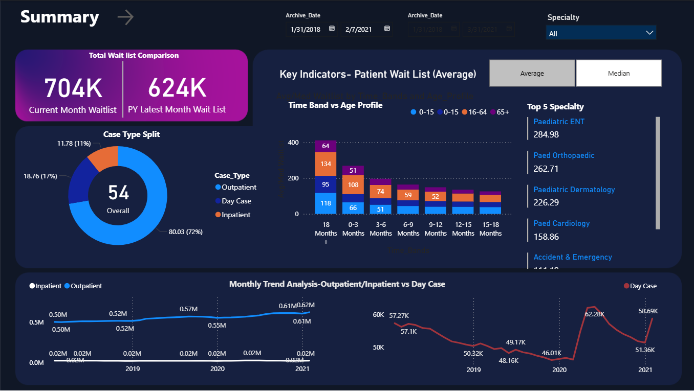

# 🏥 Healthcare Waitlist Analysis Dashboard

> ⚠️ **Disclaimer:** This project uses a simulated dataset for demonstration purposes only.  
> It is designed to showcase data analytics, SQL, and Power BI skills.

---

## 📌 Project Overview

This project analyzes patient waitlist data to uncover inefficiencies in healthcare service delivery and identify opportunities to reduce delays.

The dashboard provides a clear view of:
- Patient volume trends
- Wait time distribution
- Case type breakdown
- Specialty-level bottlenecks

---

## 🎯 Business Problem

Healthcare systems often struggle with increasing patient wait times due to:
- Limited resource allocation
- Inefficient scheduling
- Lack of visibility into bottlenecks

This project answers:

- Where are the longest delays occurring?
- Which patient groups are most affected?
- What operational improvements can be made?

---

## 🧾 Dataset Description

The dataset includes:

| Column        | Description |
|--------------|------------|
| Patient_ID   | Unique patient identifier |
| Age_Group    | Patient age segmentation |
| Case_Type    | Inpatient, Outpatient, Day Case |
| Specialty    | Medical department |
| Wait_Time    | Time (in days/months) |
| Date         | Record date |

---

## 🧠 Data Model

A **star schema** was implemented for optimal performance and scalability:

- **Fact Table:** Waitlist  
- **Dimension Tables:**
  - Date
  - Specialty
  - Age Group

---

## 🧮 SQL Analysis

The dataset was explored and validated using SQL before visualization.

### 🔹 Total Waitlist

```sql
SELECT COUNT(*) AS total_waitlist
FROM waitlist;
```


### 🔹 Average Wait Time

```sql
SELECT AVG(Wait_Time) AS avg_wait_time
FROM waitlist;
```

### 🔹 Waitlist by Case Type
```sql
SELECT Case_Type, COUNT(*) AS total
FROM waitlist
GROUP BY Case_Type
ORDER BY total DESC;
```

### 🔹 Top Delayed Specialties
```sql
SELECT Specialty, AVG(Wait_Time) AS avg_wait
FROM waitlist
GROUP BY Specialty
ORDER BY avg_wait DESC;
```

---

## 📊 Key KPIs & DAX Measures

All KPIs were built using DAX to enable dynamic filtering within Power BI.

### 📌 Total Waitlist

```DAX
Total Waitlist = COUNT('Waitlist'[Patient_ID])
```

### 📌 Previous Year Waitlist
```DAX
PY Waitlist =
CALCULATE(
    [Total Waitlist],
    SAMEPERIODLASTYEAR('Date'[Date])
)
````

### 📌 Waitlist Change %
```DAX
Waitlist Change % =
DIVIDE(
    [Total Waitlist] - [PY Waitlist],
    [PY Waitlist]
)
````

### 📌 Average Wait Time
```DAX
Avg Wait Time = AVERAGE('Waitlist'[Wait_Time])
````
---

## 📊 Dashboard Features

**The Power BI dashboard includes:**
- KPI Cards (Total Waitlist, YoY Change)
- Donut Chart (Case Type Distribution)
- Bar Chart (Waitlist by Specialty)
- Trend Analysis (Monthly patterns)
- Drill-down Table (Age Group vs Time Bands)

### 📸 Dashboard Preview 


---

## 🔍 Key Insights

- 📈 Waitlist increased by 12% YoY, indicating growing demand or capacity constraints
- 🏥 Outpatients account for ~72% of total cases
- ⏳ Longest delays occur in the 6–18 month range
- 🧠Certain specialties show significantly higher wait times

---

## 💡 Business Recommendations

**Based on the analysis:**
- Increase outpatient service capacity
- Prioritize high-delay specialties
- Optimize scheduling and triage processes
- Introduce waitlist prioritization strategies

---

## 🛠 Tools & Technologies
Power BI – Dashboard & visualization
SQL – Data exploration and validation
DAX – KPI calculations
Excel – Data preparation

---

## 📌 Project Outcome

**This dashboard enables stakeholders to:**

- Identify operational inefficiencies
- Monitor patient flow
- Make data-driven decisions to reduce wait times

---

## 👤 Author

Emmanuel Adusu
Data Analyst | Power BI | SQL | Business Intelligence

📧 Email: adusue191@gmail.com

🌐 Portfolio: https://emmanuel-adusu.github.io/


